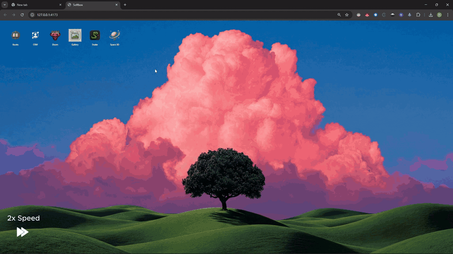
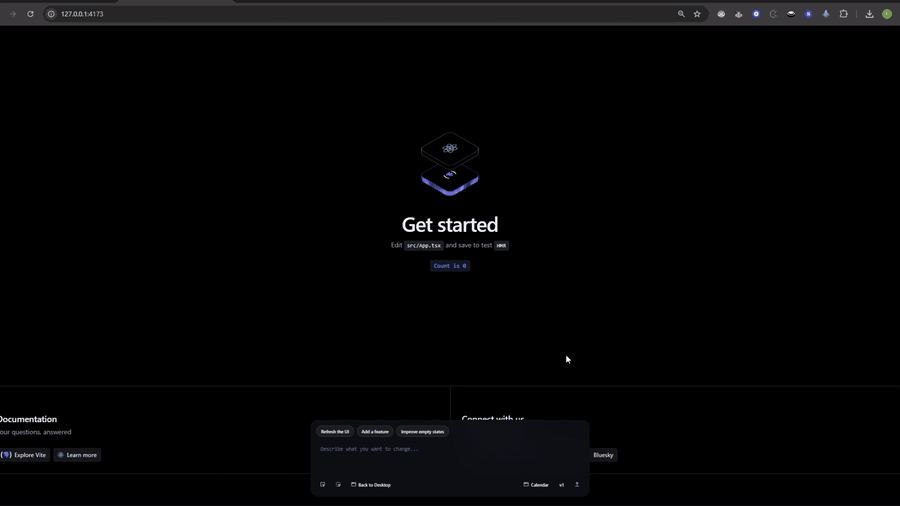

<a id="readme-top"></a>

<div align="center"><pre>
███████╗ ██████╗ ███████╗████████╗██████╗  ██████╗ ██╗  ██╗
██╔════╝██╔═══██╗██╔════╝╚══██╔══╝██╔══██╗██╔═══██╗╚██╗██╔╝
███████╗██║   ██║█████╗     ██║   ██████╔╝██║   ██║ ╚███╔╝
╚════██║██║   ██║██╔══╝     ██║   ██╔══██╗██║   ██║ ██╔██╗
███████║╚██████╔╝██║        ██║   ██████╔╝╚██████╔╝██╔╝ ██╗
╚══════╝ ╚═════╝ ╚═╝        ╚═╝   ╚═════╝  ╚═════╝ ╚═╝  ╚═╝
          Operating system for dynamic user interfaces
</pre></div>

<p align="center"><strong>Dynamic user interfaces · stable shell · OpenClaw workers · immutable previews · explicit promotion</strong></p>

<p align="center">
  <a href="https://github.com/softbox-hq/softbox"></a>
  <a href="https://github.com/softbox-hq/softbox"></a>
  <a href="https://www.convex.dev/"></a>
  <a href="https://github.com/softbox-hq/softbox"></a>
</p>

<p align="center">
  <a href="#quickstart">Quickstart</a> ·
  <a href="#how-it-works">How It Works</a> ·
  <a href="#create-an-app">Create an App</a> ·
  <a href="#architecture">Architecture</a> ·
  <a href="./SETUP.md">Full Setup</a>
</p>

---

Softbox is an operating system for dynamic user interfaces.


## ELI5

| Softbox is like a computer desktop in your browser. |
| --- |
| You right-click the desktop, make a new app, and tell it what you want. |

Examples:

<p>
  <code>Make me a calendar.</code>
  <code>Add a week view.</code>
  <code>Make the events easier to read.</code>
  <code>Add a button for creating meetings.</code>
</p>

Softbox asks an AI coding agent to change the app for you, but it does **not** immediately replace the app you are using.

| Step | What happens |
| --- | --- |
| 1 | Softbox builds a new version on the side. |
| 2 | You preview that new version first. |
| 3 | If it works, Softbox can switch to it. |
| 4 | If it is bad, your current app is still safe. |

That is the whole idea: apps can change while the desktop around them stays stable.

<!-- ## Why Softbox

Most AI app builders collapse editing, preview, and deployment into one surface. Softbox separates them.

| Layer | Responsibility |
| --- | --- |
| Shell | Stable browser runtime, prompt UI, app switching, preview mount |
| Hosted app | Normal standalone-first React/Vite app code |
| Worker | Job claiming, agent execution, build, upload, version publishing |
| Convex | Jobs, versions, apps, boxes, runtime state |
| Artifact storage | Immutable bundles through local MinIO or Cloudflare R2 |
| OpenClaw | Code edits inside the selected app workspace |

Softbox is closest to tools like Bolt.new, v0, and Lovable, but it is designed for tighter control over the runtime boundary, local services, agent routing, and version promotion.

## What It Does

- **Runs dynamic interfaces inside a stable shell**: the operating layer does not get rewritten for ordinary app changes.
- **Builds every agent change as a candidate version**: generated code is previewed before it becomes live.
- **Stores immutable artifacts**: bundles are uploaded to MinIO or R2 instead of served from a mutable workspace.
- **Tracks app and runtime state in Convex**: jobs, versions, selected app, boxes, and health state are explicit.
- **Uses OpenClaw for code mutation**: Softbox orchestrates; OpenClaw edits.
- **Supports app switching and version rollback**: move between apps and previously built versions from the shell. -->


<!-- ### Important Setup Rules

- Use `pnpm run bootstrap`, not `pnpm setup`.
- Use `pnpm run doctor`, not `pnpm doctor`.
- `VITE_CONVEX_URL` and `CONVEX_URL` must be the same Convex URL.
- Do not include a trailing slash in either Convex URL.
- Leave `OPENCLAW_AGENT_ID_PREFIX` blank unless you intentionally share agents across checkouts.
- Redis is required because BullMQ stores queue state there.
- Local MinIO is the fastest development path; switch to R2 only when you want Cloudflare-backed artifacts. -->

<!-- ## AI-Assisted Install

Recommended setup path: give a coding agent `SETUP.md` and ask it to follow the file step by step.

```text
Use SETUP.md as the source of truth. Set up this Softbox checkout end to end.
Do not skip verification. Explain each dashboard step before asking me to do it.
When editing .env.local, tell me exactly which value goes into which variable.
```

`AGENTS.md` and `CLAUDE.md` are operating instructions for agents inside this repo. They are not full installation guides. -->

# How It Works

<!-- ```text
User prompt
    |
    v
Convex job record
    |
    v
Worker claims job
    |
    v
OpenClaw edits apps/<app-id>
    |
    v
Worker builds candidate bundle
    |
    v
MinIO / R2 artifact upload
    |
    v
Shell mounts preview
    |
    v
Health check passes
    |
    v
Candidate promoted live
```

The invariant is simple: the shell is stable, the inner app is mutable, and generated code has to pass through a preview boundary before promotion. -->

# Create an App

Let's say you want to create a calendar application.

1. Right-click the desktop.
2. Click `Create app`.
3. Choose a name. In this case, use `Calendar`.
4. Choose a slug. This is the internal Softbox name for the Vite application.
5. In the description, explain what the app should do and how its icon should look.



Once the application is created, Softbox generates the default Vite boilerplate.

You can then prompt Softbox to generate the new calendar application.



Notice that the browser does not reload. The interface changes at runtime.


## Move between Applications

## Change Wallpapers

## It also runs Doom


## Quickstart

Use Claude code or codex or any agentic CLI tool and give it `SETUP.md` for a installation.

Agent than in the essence will do following:
```bash
pnpm install
pnpm run bootstrap
# fill .env.local using SETUP.md
pnpm run doctor
pnpm start
```

Once agent is done installing, you then `pnpm start` and open browser at localhost:4173

### Requirements

| Requirement | Notes |
| --- | --- |
| Node.js 20+ | Runtime for scripts, shell, and worker |
| pnpm | Use pnpm at the repo root; do not run `npm install` here |
| Docker | Recommended for local Redis and MinIO |
| Convex project | Control plane for jobs, apps, versions, runtime state |
| OpenClaw CLI | Authenticated locally; used by the worker to edit app code |
| MinIO or Cloudflare R2 | Artifact storage for built app bundles |

<!-- ## Wrap an Existing App

Softbox does not auto-mount everything under `apps/`. A hosted app needs a thin runtime bridge and config.

```bash
pnpm wrap-app -- --path apps/my-app
```

A wrapped app normally contains:

| File | Purpose |
| --- | --- |
| `softbox.config.json` | App metadata and build/runtime discovery |
| `src/entry.tsx` | Shell adapter that exports `mount(ctx)` and `unmount()` |
| `src/defaultState.ts` | Initial app state for seeding |

Keep the adapter thin. Business logic, rendering, and domain behavior should stay in the standalone app core.

## Seed Apps

Seed every wrapped app from current source:

```bash
pnpm seed -- --all --force
```

Seed one app:

```bash
pnpm seed -- --app <app-id> --force
```

Plain `pnpm seed` opens an arrow-key picker. `pnpm start` also auto-seeds wrapped apps that still have no live version, so manual seeding is mainly for explicit reseeds and repairs. -->

## Architecture
<!-- 
```text
softbox/
  shell/        Stable browser host runtime and prompt UI
  worker/       Agent orchestration, build pipeline, upload, publish
  convex/       Schema, queries, mutations, runtime state
  apps/         Standalone-first hosted app workspaces
  skills/       Repo-local agent skills, including app wrapping
  docs/         Focused architecture and integration notes
```

### Runtime Contract

The shell and hosted app communicate through a narrow mount contract. The most important source file for that contract is:

```text
worker/src/shared/liveApp.ts
```

For app onboarding and wrapper work, use:

```text
skills/softbox-wrap-app/SKILL.md
```

For app-specific edits, read the app-local `AGENTS.md` under `apps/<app>/` before changing code.

## OpenClaw Agent Routing

Softbox usually runs OpenClaw in per-app mode. Expected agent ids look like:

```text
<OPENCLAW_AGENT_ID_PREFIX><appId>
```

Check or repair the local OpenClaw agent set:

```bash
openclaw gateway status
openclaw agents list --json
pnpm worker:openclaw-sync-agents -- --apply
```

If Convex app records do not exist yet:

```bash
pnpm seed -- --all --force
pnpm worker:openclaw-sync-agents -- --apply
```

## Common Commands

| Command | Purpose |
| --- | --- |
| `pnpm run bootstrap` | Create `.env.local`, generate local agent prefix, start local services |
| `pnpm run doctor` | Validate environment and service connectivity |
| `pnpm start` | Start Convex, worker, and shell together |
| `pnpm new-app` | Create and onboard a new hosted app |
| `pnpm wrap-app -- --path apps/my-app` | Add Softbox runtime bridge to an existing app |
| `pnpm seed -- --all --force` | Rebuild and seed all wrapped apps |
| `pnpm typecheck` | TypeScript project check |
| `pnpm test` | Run Vitest |

## Storage Modes

| Provider | Best for | Env setting |
| --- | --- | --- |
| MinIO | Local development and VM installs | `ARTIFACT_STORAGE_PROVIDER=minio` |
| Cloudflare R2 | Durable shared artifact storage | `ARTIFACT_STORAGE_PROVIDER=r2` |

Fresh checkouts default to local MinIO values in `.env.example`. If you switch to R2, fill `S3_API`, `PUBLIC_DEVELOPMENT_URL`, `R2_ACCESS_KEY_ID`, and `R2_SECRET_ACCESS_KEY` as described in `SETUP.md`.

## Migration And Repair

Older local Convex data from the pre-migration `templateId` architecture can be inspected and rewritten once:

```bash
pnpm worker:migrate-app-ids
pnpm worker:migrate-app-ids -- --apply
```

Existing OpenClaw box rows can be attached to the current engine/provider profile tables:

```bash
pnpm worker:backfill-box-profiles
``` -->

## Documentation

| Document | Use it for |
| --- | --- |
| [`SETUP.md`](./SETUP.md) | Full local installation and verification |
| [`AGENTS.md`](./AGENTS.md) | Repository instructions for coding agents |
| [`CLAUDE.md`](./CLAUDE.md) | Claude-specific repository instructions |
| [`skills/softbox-wrap-app/SKILL.md`](./skills/softbox-wrap-app/SKILL.md) | App onboarding and wrapper work |
| [`docs/shell-host-surface.md`](./docs/shell-host-surface.md) | Shell host surface notes |
| [`docs/openclaw/gateway-control.md`](./docs/openclaw/gateway-control.md) | OpenClaw gateway integration |
| [`docs/openclaw/softbox-ui-auth.md`](./docs/openclaw/softbox-ui-auth.md) | OpenClaw UI auth notes |
| [`docs/openclaw/ws.md`](./docs/openclaw/ws.md) | OpenClaw websocket notes |
| [`docs/r2/R2-bottleneck.md`](./docs/r2/R2-bottleneck.md) | R2 storage notes |

## Project Status

Softbox is a local-first runtime for experimenting with agent-mutated apps. Treat generated app code as candidate code until it has been built, previewed, and promoted through the normal flow.

## License

[MIT](./LICENSE)

<p align="right">(<a href="#readme-top">back to top</a>)</p>
