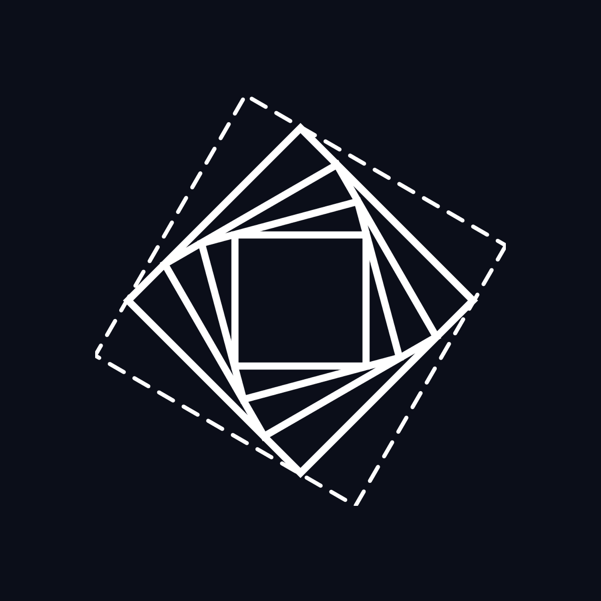
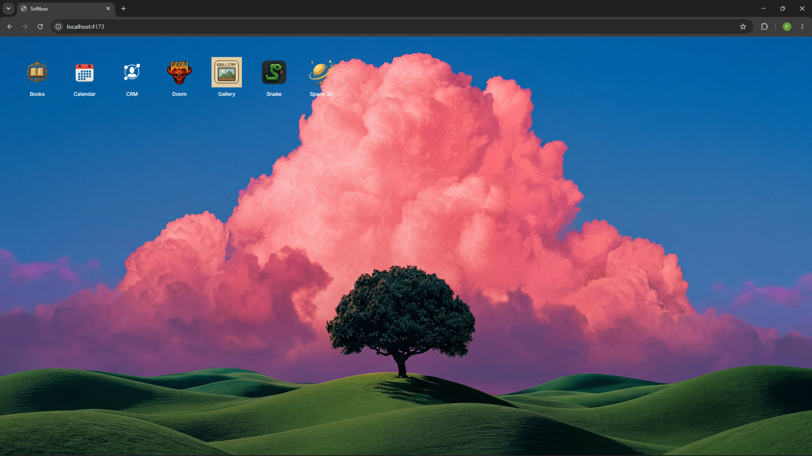
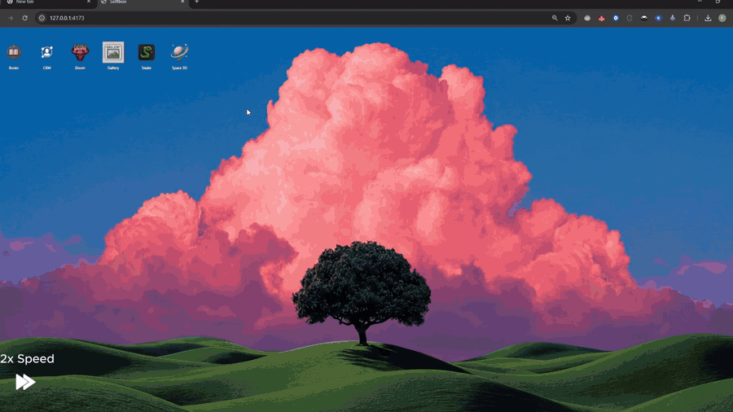

<a id="readme-top"></a>

<p align="center">
  
</p>

<p align="center"><strong>Dynamic user interfaces · stable shell · OpenClaw workers · immutable previews · explicit promotion</strong></p>

<p align="center">
  <a href="https://github.com/softbox-hq/softbox"></a>
  <a href="https://github.com/softbox-hq/softbox"></a>
  <a href="https://www.convex.dev/"></a>
  <a href="https://github.com/softbox-hq/softbox"></a>
</p>

<p align="center">
  <a href="#quickstart">Quickstart</a> ·
  <a href="#how-it-works">How It Works</a> ·
  <a href="#create-an-app">Create an App</a> ·
  <a href="#architecture">Architecture</a> ·
  <a href="./SETUP.md">Full Setup</a>
</p>

---

Softbox is an operating system for dynamic user interfaces.

## ELI5

- Softbox is like a computer desktop in your browser.
- You right-click the desktop, make a new app, and tell it what you want.
- think of sibling to bolt.new, v0 or Lovable but with novel twist.
- if you don't like button or want to add new db, you just tell the OpenClaw and it will make it happen.

# How It Works

- You downloaded this repo and installed Softbox using `SETUP.md` by passing the file to your coding agent.
- You then run `pnpm start` and now you are in your browser at `localhost:4173`



## Create an App

Let's say you want to create a calendar application.

1. Right-click the desktop.
2. Click `Create app`.
3. Choose a name. In this case, use `Calendar`.
4. Choose a slug. This is the internal Softbox name for the Vite application.
5. In the description, explain what the app should do and how its icon should look.
6. Once the application is created, Softbox generates the default Vite boilerplate.
7. You can then prompt Softbox to generate the new calendar application. `create calendar app. basic stuff`



> Notice that the browser nor input field does not reload. This is due to the idea that the prompt input envelops the Vite application. Think of analogy as softbox is your hands, and the vite application is a rubick cube.


## Dynamic interface

Having calendar app generated, let's say I dont like the background, and I want to change it.
> you can also think of Softbox that instead of having night theme written by developers, if you want night theme just tell, if you dont dont tell.


### Inspect mode
By clicking on prompt bar you have option to select elements to change or modify ... you might want to have the sidebar poped as modal instead being on the side..


## Change versions of app

## Move between Applications

## Change Wallpapers

## It also runs Doom
In `/apps/doom` you will find `DOOM.WAD` which is open source version of doom (freedoom).

To play classical version of doom just change WAD file from freedoom to original - you need to purchase it online.


## Summary
The result is whole Vite application that can be run without softbox. Each application in softbox is standalone vite application, you can extract it from softbox and run.

You can therefore think of softbox as:
 - builder app, similiar to v0, bolt.new or Lovable
 - novel/experimental solution for dynamic interface


# Quickstart

Use Claude code or codex or any agentic CLI tool and give it `SETUP.md` to install.

Agent in the essence will do following:
```bash
pnpm install
pnpm run bootstrap
# fill .env.local using SETUP.md
pnpm run doctor
pnpm start
```

Once agent is done installing, you then `pnpm start` and open browser at localhost:4173

> In case of any issues with installation, consult it with AI agent, pass them `/docs/` as a reference.

## Requirements

| Requirement | Notes |
| --- | --- |
| Node.js 20+ | Runtime for scripts, shell, and worker |
| pnpm | Use pnpm at the repo root; do not run `npm install` here |
| Docker | Recommended for local Redis and MinIO |
| Convex project | Control plane for jobs, apps, versions, runtime state |
| OpenClaw CLI | Authenticated locally; used by the worker to edit app code |
| MinIO or Cloudflare R2 | Artifact storage for built app bundles |

> From your side as a human, there shoulnd be too much to install, AI agent will manage it all, but you might have to hatch openclaw if havent done so. 

## Documentation

| Document | Use it for |
| --- | --- |
| [`SETUP.md`](./SETUP.md) | Full local installation and verification |
| [`AGENTS.md`](./AGENTS.md) | Repository instructions for coding agents |
| [`CLAUDE.md`](./CLAUDE.md) | Claude-specific repository instructions |
| [`skills/softbox-wrap-app/SKILL.md`](./skills/softbox-wrap-app/SKILL.md) | App onboarding and wrapper work |
| [`docs/shell-host-surface.md`](./docs/shell-host-surface.md) | Shell host surface notes |
| [`docs/openclaw/gateway-control.md`](./docs/openclaw/gateway-control.md) | OpenClaw gateway integration |
| [`docs/openclaw/softbox-ui-auth.md`](./docs/openclaw/softbox-ui-auth.md) | OpenClaw UI auth notes |
| [`docs/openclaw/ws.md`](./docs/openclaw/ws.md) | OpenClaw websocket notes |
| [`docs/r2/R2-bottleneck.md`](./docs/r2/R2-bottleneck.md) | R2 storage notes |


## License

[MIT](./LICENSE)

<p align="right">(<a href="#readme-top">back to top</a>)</p>
