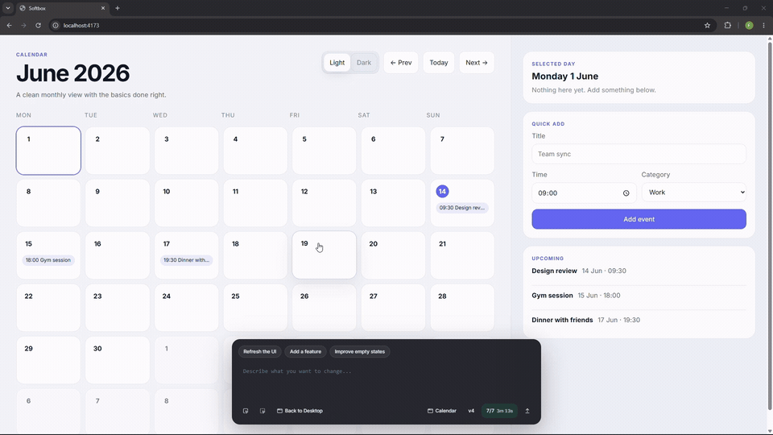
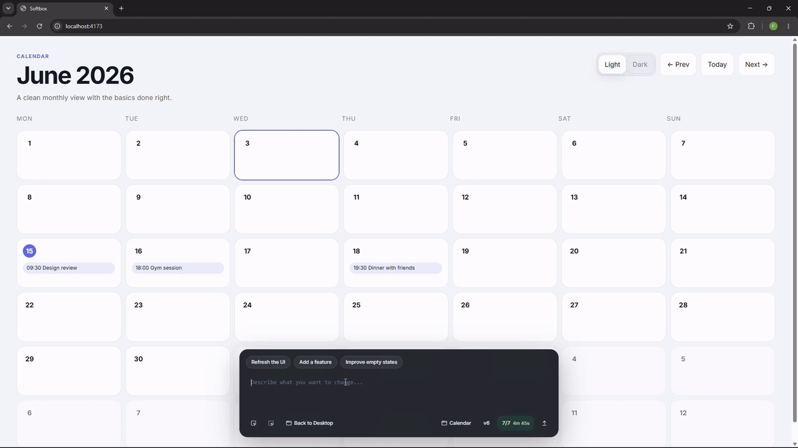
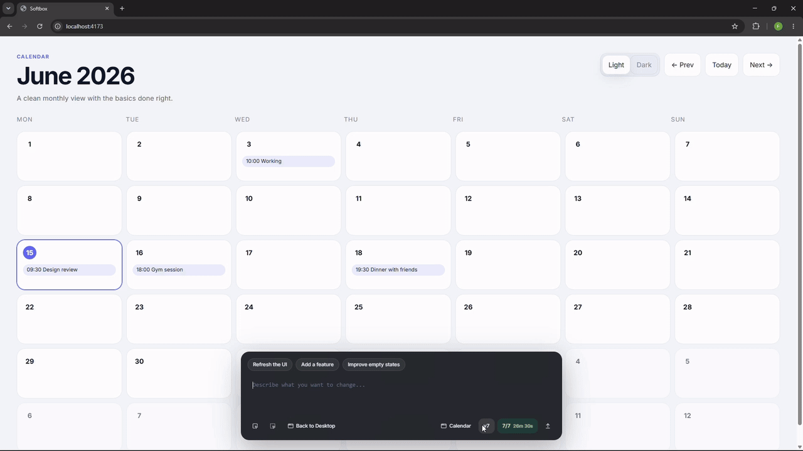
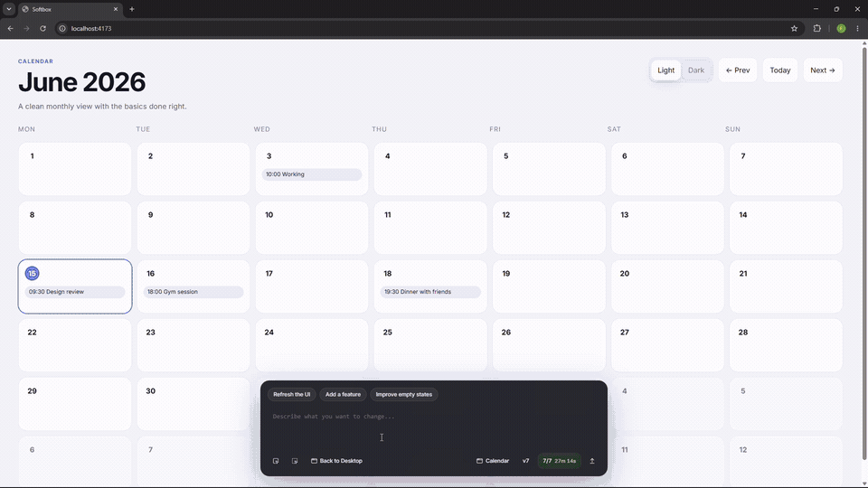

<a id="readme-top"></a>

<p align="center">
  <picture>
    <source media="(prefers-color-scheme: light)" srcset="docs/assets/softbox-github-hero-logo-for-light-theme.svg">
    
  </picture>
</p>

<p align="center"><strong>Operating system for dynamic user interfaces.</strong></p>

<p align="center">
  <a href="https://github.com/softbox-hq/softbox"></a>
  <a href="https://github.com/softbox-hq/softbox"></a>
  <a href="https://www.convex.dev/"></a>
  <a href="https://github.com/softbox-hq/softbox"></a>
</p>

<p align="center">
  <a href="#quickstart">Quickstart</a> ·
  <a href="#how-it-works">How It Works</a> ·
  <a href="#create-an-app">Create an App</a> ·
  <a href="#architecture">Architecture</a> ·
  <a href="./SETUP.md">Full Setup</a>
</p>

## ELI5

- Softbox is like a computer desktop in your browser.
- You right-click the desktop, make a new app, and tell it what you want.
- Think of it as a sibling to bolt.new, v0, or Lovable, but with a different twist.
- If you do not like a button, want a new database, or need the app to behave differently, you tell OpenClaw and it edits the app for you.

# How It Works

After installation, Softbox runs as a local desktop-like environment in your browser.

1. Clone this repository.
2. Give [`SETUP.md`](./SETUP.md) to your coding agent and ask it to complete the setup.
3. Run `pnpm start`.
4. Open [`localhost:4173`](http://localhost:4173) in your browser.

From there, you can create apps, prompt OpenClaw to edit them, preview generated versions, and promote the version you want to keep.

<p align="center">
  <picture>
    <source media="(prefers-color-scheme: light)" srcset="docs/assets/github-softbox-main-screen.png">
    
  </picture>
</p>

## Create an App

Let's say you want to create a calendar application.

1. Right-click the desktop.
2. Click `Create app`.
3. Choose a name. In this case, use `Calendar`.
4. Choose a slug. This is the internal Softbox name for the Vite application.
5. In the description, explain what the app should do and how its icon should look.
6. Once the application is created, Softbox generates the default Vite boilerplate.
7. Prompt Softbox to generate the calendar app. For example: `create calendar app. basic stuff`


> Notice that the browser and prompt input do not reload. The prompt input wraps the Vite application, so you can keep interacting with the app while Softbox prepares the next version.


## Dynamic interface

After generating the calendar app, let's say you do not like the background and want to change it.

> [!TIP]
> You can think of Softbox as an interface that changes when you ask. Instead of waiting for developers to build a night theme, you can simply ask for one.


### Inspect mode
Click the prompt bar to enter inspect mode. From there, you can select elements to change or modify. For example, you might ask Softbox to move a sidebar into a modal instead of keeping it on the side.



### Update the backend as well

A calendar also needs a backend. Prompt Softbox to create a SQL database, and the app can store data across future runs. The data persists between sessions.




## Change app versions or roll back
If you are not satisfied with a generated version, roll back with one click.




## Move between applications

When you want to switch applications, click `Back to desktop`.



## Change wallpapers
You can also change the desktop background.


## Interesting use cases

Dynamic interfaces make some applications feel closer to science fiction. Since Softbox uses Vite, hosted apps can also render 3D experiences.

For example, when you open the Space 3D app and say `lock my view to jupiter`, OpenClaw rewrites the app code and points the camera at Jupiter.

This means you do not need to hard-code every possible action, such as navigation, distance, camera movement, or planet selection. You can describe what you want, and Softbox can prepare a new version of the app.

This still has limitations. See [Limitations](#limitations).

## It also runs Doom
In `/apps/doom`, you will find `DOOM.WAD`, which is the open source Freedoom WAD.

To play the classic version of Doom, replace the Freedoom WAD with the original WAD. You need to purchase the original game separately.


## Summary: what Softbox solves

The calendar example shows the core idea: instead of using the same generic interface as everyone else, you can ask Softbox to shape the app around your own workflow.

If you want a light and dark theme switch, ask for it. If a sidebar should become a popup, ask for it. If your contracts need a SQLite database, ask for it.

That is the idea behind Softbox: the application adapts to you instead of forcing you to adapt to the application.

Of course, a basic generated calendar app will not replace a mature product like Google Calendar. This repo explores a different path, where users can choose what they want to see and how their apps should behave.

The result is a complete Vite application that can run without Softbox. Each app in Softbox is a standalone Vite app, so you can extract it and run it separately.

You can therefore think of Softbox as:
 - a builder app, similar to v0, bolt.new, or Lovable
 - a novel and experimental runtime for dynamic interfaces

## Architecture

Softbox keeps the browser shell stable while app code changes underneath it. The shell records prompts and previews generated app versions. The worker asks OpenClaw to edit the selected app workspace, builds a candidate version, uploads the artifacts, and only promotes the candidate after health checks pass.


## Limitations
Model inference is currently slow. Most changes require a few minutes of waiting.


# Quickstart

Use Claude Code, Codex, or another agentic CLI tool, and give it `SETUP.md` to install Softbox.

The agent will roughly follow this sequence:
```bash
pnpm install
pnpm run bootstrap
# fill .env.local using SETUP.md
pnpm run doctor
pnpm start
```

Once the agent is done installing, run `pnpm start` and open [`localhost:4173`](http://localhost:4173).

> [!NOTE]
> If you run into installation issues, ask your AI agent to inspect `/docs/` as a reference.

## Requirements

| Requirement | Notes |
| --- | --- |
| Node.js 20+ | Runtime for scripts, shell, and worker |
| pnpm | Use pnpm at the repo root; do not run `npm install` here |
| Docker | Recommended for local Redis and MinIO |
| Convex project | Control plane for jobs, apps, versions, runtime state |
| OpenClaw CLI | Authenticated locally; used by the worker to edit app code |
| MinIO or Cloudflare R2 | Artifact storage for built app bundles |

> As a human, there should not be too much to install manually. Your AI agent can manage most of it, but you may need to authenticate OpenClaw if you have not done so yet.

## Documentation

| Document | Use it for |
| --- | --- |
| [`SETUP.md`](./SETUP.md) | Full local installation and verification |
| [`AGENTS.md`](./AGENTS.md) | Repository instructions for coding agents |
| [`CLAUDE.md`](./CLAUDE.md) | Claude-specific repository instructions |
| [`skills/softbox-wrap-app/SKILL.md`](./skills/softbox-wrap-app/SKILL.md) | App onboarding and wrapper work |
| [`docs/shell-host-surface.md`](./docs/shell-host-surface.md) | Shell host surface notes |
| [`docs/openclaw/gateway-control.md`](./docs/openclaw/gateway-control.md) | OpenClaw gateway integration |
| [`docs/openclaw/softbox-ui-auth.md`](./docs/openclaw/softbox-ui-auth.md) | OpenClaw UI auth notes |
| [`docs/openclaw/ws.md`](./docs/openclaw/ws.md) | OpenClaw websocket notes |
| [`docs/r2/R2-bottleneck.md`](./docs/r2/R2-bottleneck.md) | R2 storage notes |


## License

[MIT](./LICENSE)

<p align="right">(<a href="#readme-top">back to top</a>)</p>
