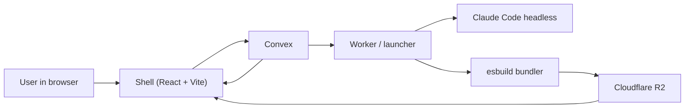

# Architecture

## System Overview

The repository is a small live app platform with one stable outer shell and one mutable inner app.

## Main Components

### `shell/`

The browser-facing application.

Responsibilities:

- prompt form
- reading shell state from Convex
- loading version manifests from R2
- importing live bundles dynamically
- previewing candidate versions
- promoting candidates after health checks
- reporting runtime errors back to Convex

The shell is intended to remain stable while the live app changes.

### `apps/live-app-template/`

The mutable frontend app that the coding agent edits.

Responsibilities:

- rendering the actual live experience
- exporting the runtime contract expected by the shell
- calling `reportHealthy()` after mount
- calling `reportError(...)` on runtime failures

Normal prompts are expected to affect only:

- `apps/live-app-template/src/**`

### `worker/`

A thin launcher process.

Responsibilities:

- polling for pending jobs in Convex
- invoking Claude Code from the project root
- diffing changed files
- bundling the live app
- uploading artifacts to R2
- recording new versions or failures back to Convex

The worker should not contain the product intelligence.
That lives in:

- the editable source tree
- `CLAUDE.md`
- the prompt itself

### `convex/`

Realtime control plane and source of truth.

Responsibilities:

- app records
- file snapshot records
- prompt job queue
- version metadata
- persisted build/runtime errors

Convex does not host the bundle binaries themselves.

### `CLAUDE.md`

The behavioral contract for Claude Code.

Responsibilities:

- defining the editing scope
- protecting stable parts of the repo
- documenting the live app contract
- nudging Claude toward incremental edits

## Live App Contract

The shell expects every built live bundle to provide a minimal plugin-like interface.

The important exports are:

- `mount`
- `unmount`
- `initialLiveAppState`

The runtime passes:

- a root DOM node
- the initial state
- a `publishState` callback
- a `reportHealthy` callback
- a `reportError` callback

That is the seam between shell and mutable app.

## Data Model

Convex currently stores five main concepts.

### `apps`

Top-level app metadata.

Tracks:

- `appId`
- current active version
- current state snapshot
- latest build/runtime error text

### `appFiles`

The editable file snapshot for the live app.

Tracks:

- path
- content
- update time

This is useful because the system needs a persistent record of the editable source, not only the latest bundle.

### `jobs`

Prompt requests moving through the launcher pipeline.

Tracks:

- prompt text
- status: `pending`, `running`, `failed`, `completed`
- agent result summary
- build error
- resulting version id

### `versions`

Versioned build metadata.

Tracks:

- version number
- manifest URL
- build log
- runtime health
- state JSON
- optional agent result summary

### `runtimeErrors`

Reported client-side runtime failures.

Used to preserve failure context across prompts and reloads.

## Build Artifacts

The bundler produces immutable versioned outputs in R2, for example:

- `apps/demo/v6/entry.js`
- `apps/demo/v6/chunk-XYZ.js`
- `apps/demo/v6/manifest.json`

Each version is a new immutable artifact set.

The shell never mutates an existing version in place.

## Why Immutable Versions Matter

Immutable versioning makes the runtime much easier to reason about.

Benefits:

- easier rollback
- safer live preview
- deterministic artifact URLs per version
- easier debugging when a specific build is bad

Without immutable versions, the shell would have a much harder time distinguishing:

- the current stable app
- the next candidate app

## Candidate Preview And Promotion

The shell does not blindly switch to the newest bundle.

Instead it:

1. notices a new ready version through Convex
2. loads the manifest
3. imports the bundle in a hidden preview layer
4. mounts it with a health-check timeout
5. promotes it only if `reportHealthy()` happens in time

If the candidate fails:

- import failure
- mount exception
- runtime error during startup
- missing health signal

then the previous active version remains active.

## Why The Worker Still Exists

Even though Claude does the editing, the system still needs a process to coordinate the pipeline.

The worker exists for that orchestration layer.

It is responsible for:

- queue claiming
- process invocation
- build execution
- artifact upload
- Convex updates

Claude is the code editor.
The worker is the pipeline operator.

## File Boundaries

The repository intentionally separates stable and mutable code.

Stable:

- `shell/**`
- `convex/**`
- `worker/**`
- package metadata

Mutable during normal prompts:

- `apps/live-app-template/src/**`

This is one of the most important architectural choices in the project.

## Limitations

Current limitations include:

- local-only workflow
- single controlling user
- no hardened sandbox for hostile public use
- no dependency installation during normal prompts
- only frontend live app code is mutable
- runtime UI still needs polish around long-running or stale jobs

Those are product boundaries, not accidents.

The project is trying to prove the live-code loop first.
