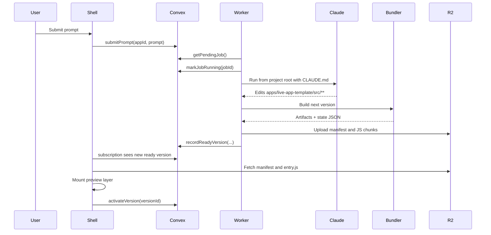

# Runtime Flow

## End-To-End Lifecycle

This document explains what actually happens after a user presses the prompt button.

## Step 1: Prompt Submission

The shell sends the user prompt to Convex.

Convex stores a new job with:

- the prompt
- `status: "pending"`
- the app id
- a reference to the base active version

This keeps the browser thin. The browser does not talk to Claude directly.

## Step 2: Job Claim

The worker polls Convex for pending jobs.

When it finds one, it marks the job as `running`.

This is the handoff from the control plane to the launcher.

## Step 3: Claude Edit Phase

The worker launches Claude Code headless:

- from the project root
- with `CLAUDE.md` available
- with a prompt telling Claude to modify the live app

Claude is expected to edit:

- `apps/live-app-template/src/**`

The worker then reads the live app files again and computes which files changed.

If nothing changed, the job fails.

## Step 4: Build Phase

After a successful edit, the worker builds the live app as a new version.

The bundler outputs:

- versioned entry file
- versioned chunk files
- manifest
- serialized state JSON for the new version

The new version number is derived from the current active version.

## Step 5: Upload Phase

The worker uploads the generated artifacts to R2.

Important rule:

- each version is immutable
- uploads go to a new `vN` path

This prevents the shell from accidentally loading a moving target.

## Step 6: Record Ready Version

Once upload succeeds, the worker records the new version in Convex and marks the job `completed`.

At this point Convex knows:

- the new version exists
- where its manifest lives
- what state it should start with
- what Claude claims it changed

## Step 7: Preview Phase In The Browser

The shell subscribes to Convex state.

When it sees a new ready version higher than the current active version, it:

1. loads the manifest
2. imports the bundle into a hidden preview layer
3. calls `mount(...)`
4. waits for `reportHealthy()`

This is the most important safety step.

The app does not become active just because the worker built it.

See also:

- [`preview-promotion-race.md`](/home/fvrlak/ventures/softbox/docs/preview-promotion-race.md)
  - Concrete regression note for what broke after iframe isolation, and why preview/promotion logic must be keyed to stable version identity rather than subscription churn.
- [`mounted-routing.md`](/home/fvrlak/ventures/softbox/docs/mounted-routing.md)
  - Routed apps must not rely on iframe `window.location`; mounted mode should use shell-backed route state instead.

## Step 8: Promotion Or Rollback

If the previewed version reports healthy, the shell activates it and tells Convex that the version is now active.

If the previewed version fails, the shell reports the failure and leaves the old active version in place.

That means the user never has to accept a broken update as the active app.

## What The User Sees

The shell UI is meant to show three different things clearly:

- what the active live app is
- what job is currently in flight
- what the last completed agent output was

Those are different concepts and should not be collapsed into one generic "status".

## Failure Modes

Typical failure points:

- Claude makes no edit
- Claude edits the wrong files
- build fails
- upload fails
- bundle import fails
- live app throws on mount
- live app never reports healthy

The system is designed so these failures do not automatically destroy the active version.

## Why This Flow Matters

The important property is that the system does not treat code generation as a side artifact.

Code generation is part of the live runtime path.

That is the core proposition of this repository:

- code can be the thing that changes live
- versioning can still keep the app safe
- the shell can remain stable while the inside evolves
